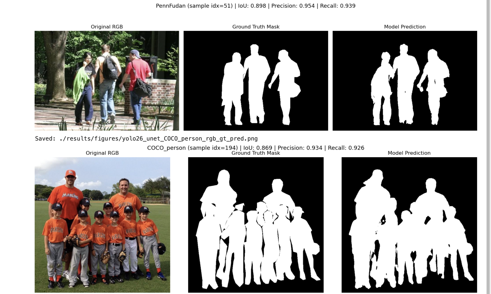

<h1 align="center">YOLO + UNET for human segmentation tasks</h1>

<a href="https://huggingface.co/spaces/Kbis/segment-human">Live Demo (HuggingFace)</a>
    

>   
>     
>

Human segmentation is a computer vision task that isolates human figures from complex backgrounds, ranging from easy, centered figures to 
occluded figures in unfavorable environments, including poor lighting. It is an active and challenging research field with diverse 
applications and approaches toward perfect, or near-perfect, human segmentation. Some of these approaches are generally applied across 
different domains, and as solutions for segmenting objects other than humans. Many of them achieve impressive results on their object of 
concern.

In this experiments, I took ideas from existing literature on how segmentation task was approached and apply it to segmenting human figures in images. The algorithms and implementations may not exactly match what's suggested in the literature; they're 
inspired by it.

## Datasets  

- **LIP** [2000 images from Human Parsing Dataset](https://huggingface.co/datasets/mattmdjaga/human_parsing_dataset)     
- **COCO** [2000 images of person-class subset of COCO 2017 validation set](https://cocodataset.org)    
- **Penn-Fudan** [170 images from Penn-Fudan Pedestrian Dataset](https://www.cis.upenn.edu/~jshi/ped_html/)    
- **MADS** [1192 images from Martial Arts, Dancing and Sports dataset](https://www.kaggle.com/datasets/tapakah68/segmentation-full-body-mads-dataset)       

## Findings
Results of this experiment is documented here ([models/yolo26_unet](models/yolo26_unet))    
