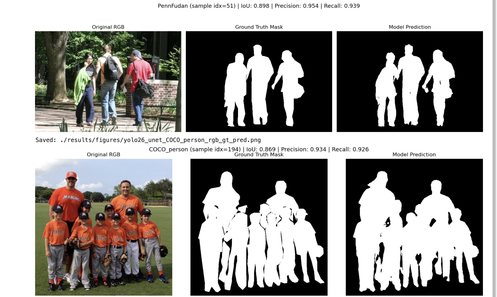

# YOLO26 + Finetuned UNET

**Reference:** Sheraz, H., Khan, Z. A., & Awais, M. (2025). Human instance segmentation based on omega-shape using deep learning. [Link](https://www.researchgate.net/publication/389842912_Human_Instance_Segmentation_Based_on_Omega-_Shape_Using_Deep_Learning)

## In this paper

Sheraz, Khan, and Awais looked at human instance segmentation in crowded, cluttered environments, where most full-body segmentation
approaches break down due to occlusion. Instead of segmenting the whole body, they proposed detecting just the "omega-shape" region (head
and shoulders), since this stays visible even when the rest of a person is blocked by crowding or overlap. The goal was tighter masks with
less background clutter, useful for downstream tasks like tracking.

They used the Pascal-Part dataset (annotations built on PASCAL VOC 2010), narrowed to 3,503 human-class images, split 70/30 for training
and validation/testing. Two architectures were compared:

- **Mask R-CNN** with a ResNet-101 + FPN backbone, using pre-trained weights and transfer learning
- **YOLO+UNET**, a custom pipeline where a modified YOLOv3 proposes regions, ROIAlign crops and standardizes them, and a reduced 14-layer
  UNET segments each crop

**Results:** Mask R-CNN hit 92.6% accuracy at 6 FPS. YOLO+UNET reached 88.4% accuracy at 29 FPS, almost five times faster. They framed this as a real accuracy/speed trade-off: Mask R-CNN when accuracy matters most, YOLO+UNET when speed does.

## Main concept

In their modified YOLO+UNET model, YOLO detects the bounding boxes of each instance then ROI-Align crops these instances from the feature vector.
UNET takes each cropped instance one by one as input and gives the segmented output.

## In this experiment

I take inspiration from their YOLO+UNET approach to test a similar two-stage detection-then-segmentation pipeline on human segmentation tasks,
using pre-trained tools rather than reproducing their exact setup. I implemented YOLO26 (small variant) for person region proposal, paired with
a UNET (ResNet-50 encoder, ImageNet-pretrained) for segmenting each detected crop. I fine-tuned only the UNET decoder, on a portion of the combined datasets.
Evaluation was carried out on three datasets (Penn-Fudan pedestrian dateset, and the main combined **LIP+COCO+MADS+Penn**), using mIoU, pixel accuracy, precision, and recall as the comparison metrics.

## Dataset used

- **LIP** [2000 images from Human Parsing Dataset](https://huggingface.co/datasets/mattmdjaga/human_parsing_dataset)     
- **COCO** [2000 images of person-class subset of COCO 2017 validation set](https://cocodataset.org)    
- **Penn-Fudan** [170 images from Penn-Fudan Pedestrian Dataset](https://www.cis.upenn.edu/~jshi/ped_html/)    
- **MADS** [1192 images from Martial Arts, Dancing and Sports dataset](https://www.kaggle.com/datasets/tapakah68/segmentation-full-body-mads-dataset)       

All datasets contain RGB images with pixel-level binary human segmentation masks. Images were split per dataset using a stratified 
75/10/15 train/validation/test split to ensure each dataset is represented across all three splits except for **Penn-Fudan**, which was a 60/40 split for train/test.

## Sample Results  
     

